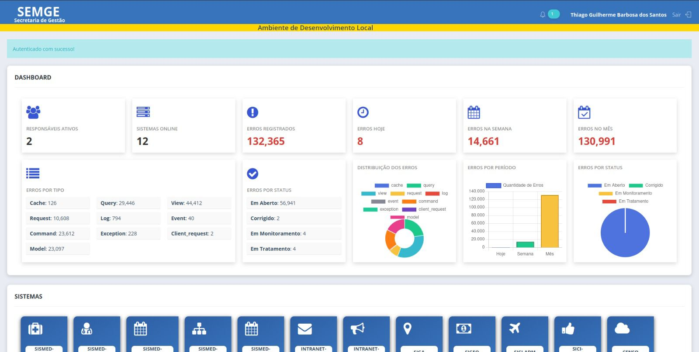
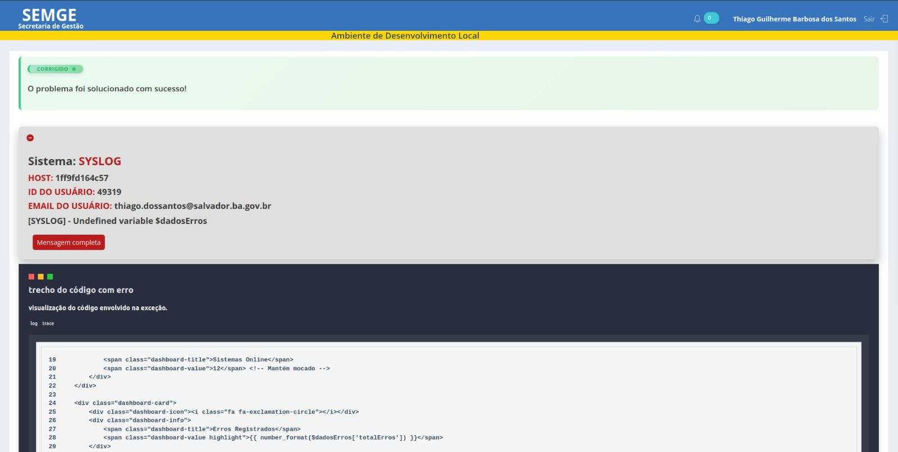
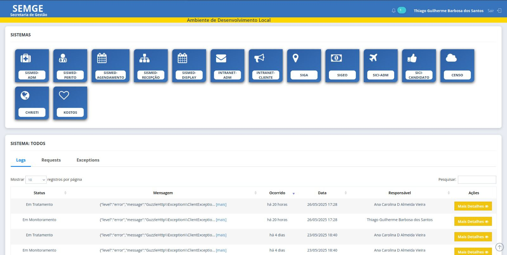

# SysLog

Sistema de gerenciamento de logs e auditoria interna.

## 📋 Descrição

O **SysLog** é um sistema desenvolvido para monitorar, registrar e auditar atividades de sistemas e usuários, fornecendo maior controle e rastreabilidade para organizações.

